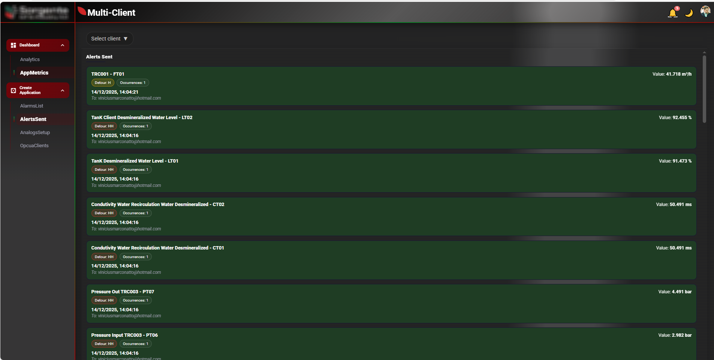
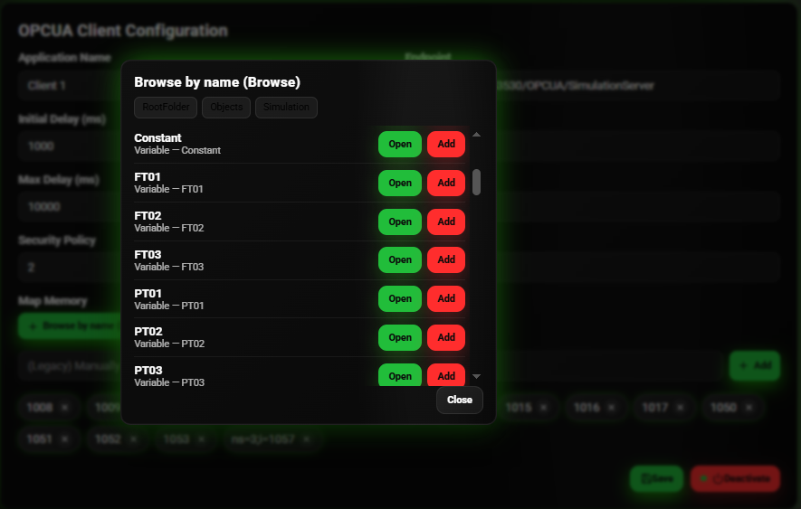
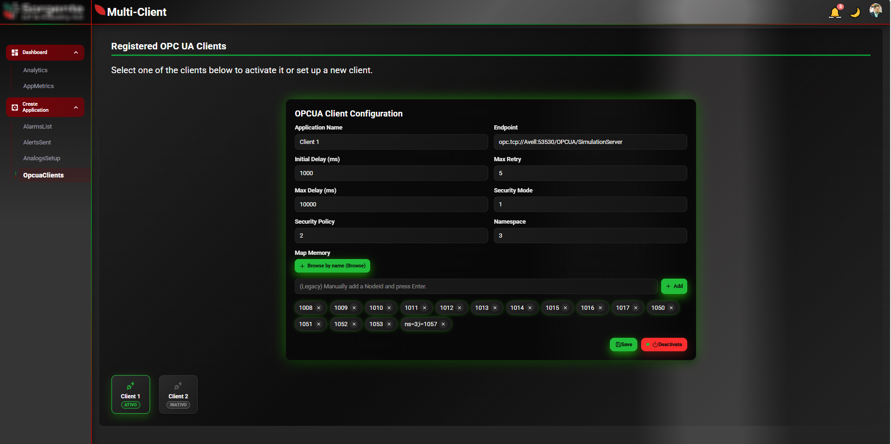
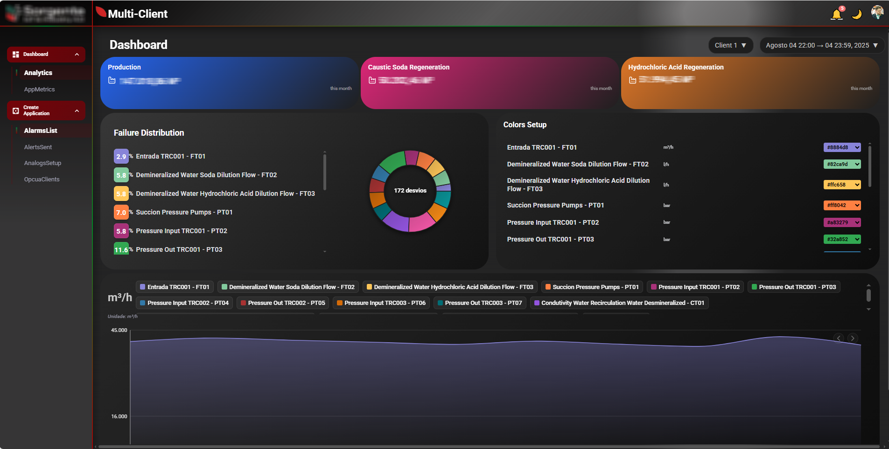
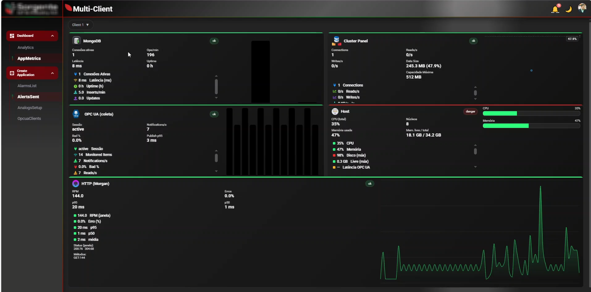

# 🧠 OPC UA Multi-Client Data Collector

**Backend: Node.js + TypeScript + MongoDB**  
**Frontend: React + TypeScript + Styled Components**

---
## Observação
Optei por comentar todo o programa com JSDOC em Português. Este repositório tem acesso apenas aos componentes de páginas do React, para acesso completo ao diretório do BackEnd e o restante dos componentes React, consulte as condições descritas na licença.

## 📘 Visão Geral

Este projeto implementa um **coletor de dados OPC UA multi-cliente** com arquitetura **Node.js + TypeScript + MongoDB + React**, projetado para ambientes industriais.  
O sistema permite a **criação dinâmica de múltiplas instâncias independentes de clientes OPC UA**, cada uma comunicando-se com diferentes servidores OPC UA na rede, armazenando leituras e telemetrias em coleções isoladas no MongoDB.

O **frontend React/TypeScript** atua como painel de monitoramento e análise, exibindo em tempo real as variáveis coletadas, o status das conexões, alertas de limite e dashboards históricos.

- Frontend ⇄ Backend: HTTP/HTTPS (REST) e, quando necessário, WebSockets.  
- Backend ⇄ OPC UA: sessões/assinaturas mantidas pelos clientes OPC UA (node-opcua).  
- Backend ⇄ MongoDB: escrita de telemetria e leitura para as rotas da API.

---

🔩 Backend (Node.js + TypeScript)
Gerencia múltiplas instâncias de OpcuaClient através do ClientManager.

Cada instância conecta-se a um endpoint OPC UA distinto.

Coleta periódica (polling) de variáveis e escrita em MongoDB.

Coleções dinâmicas por cliente:
Client01_Transmiters, Client02_Transmiters, Client03_Transmiters

Pipeline de agregação temporal e filtragem por mês/ano, hora inicial/final.

Sistema de alertas (e-mail / WhatsApp) baseado em limites configurados nos arquivos ClientXX_setuptsconfig.json.

🖥️ Frontend (React + TypeScript)
Interface de dashboards industriais com múltiplos componentes:

TotalizerBox – KPIs agregados

HistoryBox – histórico temporal

PieChartBalance – relação de falhas por variável

MongoDBBox / OPCUABox / HostMetricsBox – status de infraestrutura

Estilização modular via styled-components

Animações com Framer Motion

Comunicação via Axios / Fetch com o backend

Documentação completa via JSDoc padronizado
## 🧩 Estrutura de Diretórios

```text
backend/
├── src/
│   ├── clients/   # Instâncias OPC UA (Client01, Client02, etc.)
│   ├── core/      # ClientManager, Device_WriteDB, alert schedulers
│   ├── routes/    # Rotas REST (status, telemetria, histórico)
│   ├── utils/     # Helpers e pipelines de agregação MongoDB
│   └── config/    # Setup e limites por cliente
├── package.json
├── tsconfig.json
└── .env.example

frontend/
├── src/
│   ├── components/  # UI Boxes
│   ├── hooks/       
│   ├── pages/       
│   ├── services/    
│   └── styles/      
├── package.json
├── tsconfig.json
└── public/
    └── favicon.ico
```
🧠 Tecnologias Principais:
Backend:
Node.js / TypeScript	Core da aplicação OPC UA
node-opcua	Implementação do cliente OPC UA
Express.js	API REST entre BackEnd ↔ FrontEnd
MongoDB / Mongoose	Armazenamento dos dados de telemetria
Nodemailer / WhatsApp API	Alertas automáticos
Winston / Morgan	Logging e auditoria
dotenv	Configuração por ambiente

Frontend:
React + TypeScript	Framework principal da UI
styled-components	CSS-in-JS e temas dinâmicos
Framer Motion	Animações de interface
Recharts	Visualização de dados (gráficos)
Axios	Comunicação HTTP com o backend
React Router DOM	Navegação SPA
Context API	Autenticação, tema e mensagens globais

🚀 Instalação e Execução
Pré-requisitos
Node.js 18+

MongoDB em execução local ou remoto

NPM ou Yarn

1️⃣ Backend

bash
Copiar código
cd backend
npm install
cp .env.example .env
# configure variáveis: mongodb_uri, Opcua_EndPoints, Email_Service, etc
npm run dev
2️⃣ Frontend

bash
Copiar código
cd ../frontend
npm install
npm run dev

🖼️ Interface Preview
Abaixo estão capturas de tela da aplicação Multi-Client Collector, ilustrando o frontend React e os principais painéis industriais do sistema.

<p align="center">  </p> <p align="center"><i>Figura 1 — <b>Alerts Sent</b> — Lista cronológica de alertas gerados automaticamente pelo backend, com exibição do nome do instrumento, tipo de desvio (HH, LL etc.), valor atual e timestamp. Cada alerta também mostra o e-mail de destino configurado. Esta tela consolida, em tempo real, os eventos de falha detectados via OPC UA e armazenados no MongoDB.</i></p>
<p align="center">  </p> <p align="center"><i>Figura 2 — <b>Browser OPC UA</b> — Ferramenta de navegação para listar variáveis do servidor OPC UA em tempo real. Permite explorar nós, abrir detalhes e adicioná-los ao mapeamento do cliente usando o botão <b>Add</b>. Cada linha representa um nó com nome simbólico (FT01, PT02 etc.), facilitando o mapeamento de variáveis industriais sem precisar digitar NodeIds manualmente.</i></p>
<p align="center">  </p> <p align="center"><i>Figura 3 — <b>OPCUA Client Configuration</b> — Formulário de configuração do cliente OPC UA. Permite registrar endpoints, definir políticas de segurança (<b>Security Policy</b> e <b>Mode</b>), ajustar intervalos de leitura (<b>Initial Delay</b> / <b>Max Delay</b>) e gerenciar variáveis monitoradas. A seção <b>Map Memory</b> exibe todos os NodeIds adicionados manualmente ou via <b>Browse by name</b>. Cada cliente (Client 1, Client 2 etc.) representa uma sessão OPC UA independente gerenciada pelo backend.</i></p>
<p align="center">  </p> <p align="center"><i>Figura 4 — <b>Dashboard</b> — Tela analítica que consolida variáveis de processo e estatísticas históricas. Os cards superiores mostram totalizadores mensais de produção e regeneração. O painel <b>Failure Distribution</b> exibe a participação percentual de falhas por instrumento, enquanto <b>Colors Setup</b> permite configurar as cores das linhas no gráfico. O componente inferior <b>HistoryBox</b> mostra séries históricas do MongoDB com controle de visibilidade, unidade de engenharia e range de medição por variável.</i></p>
<p align="center">  </p> <p align="center"><i>Figura 5 — <b>Service Metrics</b> — Painel técnico de diagnóstico em tempo real. Exibe métricas do <b>MongoDB</b> (conexões, latência), <b>OPC UA</b> (sessões, notificações, publish p95), <b>HTTP/Morgan</b> (requisições e tempos médios) e <b>Host</b> (uso de CPU, memória e disco). Este painel fornece uma visão consolidada da saúde operacional do backend e de seus serviços de coleta e persistência.</i></p>
